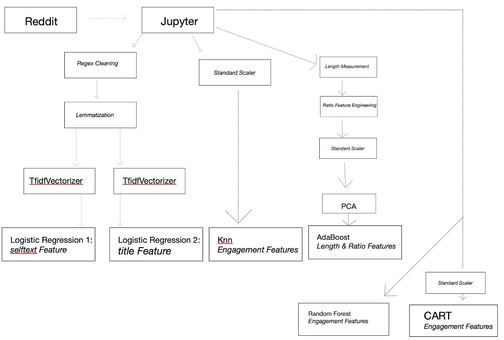
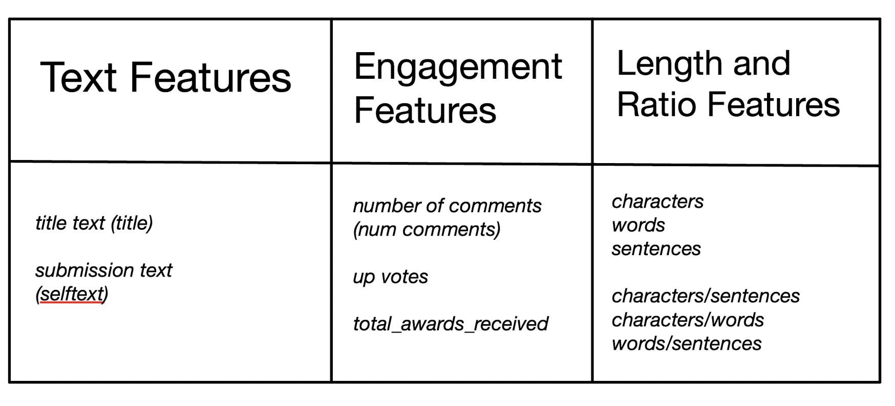

# Background
          Reddit is a social media site centered around news agggregation, content rating and discussion threads. Reddit is divided into "subreddits" which are subsections reddit, bringing all of reddit's functionality to a narrow theme or subject matter. People who would like to share text with other reddit users, will create a submission. If the subject matter of a submission corresponds to a subreddit, the user will typically post the submission to that subreddit.  r_stocks and r_investing are two subreddits.  
          These two subreddits are deeply similar sharing a cosine similarity score of .75 according to shorttails. Similarity between subreddits is based on the cosine similarity of their word vectors.     
## Sources:
https://www.shorttails.io/interactive-map-of-reddit-and-subreddit-similarity-calculator/  
https://fivethirtyeight.com/features/dissecting-trumps-most-rabid-online-following/  
https://www.reddit.com/r/investing/  
https://www.reddit.com/r/stocks/  

# Problem Statement
Person “X" works at a fintech startup and wants to create a sentiment indicator of a public company. Person “X" wants to scrape the comments section of a widely-seen submission on the "hot" subsection of either r_invetsing or r_stocks, but no such submission exists. Person “X" must create that submission, but can't figure out which subreddit his submission is a more natural fit for.

Build a model that will tell Person “X" which subreddit he should post to. Assume Person “X" firm has other reddit accounts and can boost their submission's  comments, likes, and awards.
   
       
  

# Data Dictionary
The data was pulled from the following urls:  
https://oauth.reddit.com/r/investing  
https://oauth.reddit.com/r/stocks 
  

| Attributes | Definition |
| --- | --- |
| title | the title of a submission on reddit |
| selftext | the text content of a text submission |
| subreddit | the name of the subreddit where the submission was posted |
| ups | number of upvotes a submission has received|
| total_awards_received | number of awards a submission has received |
| num_comments| number of comments on the submission |
| character_count_title | number of characters in the document's (submission's) title|
| word_count_title| number of words in the document's (submission's) title|
| sentences_count_title | number of sentences in the document's (submission's) title |
| character_count_selftext | number of characters in the document's (submission's) selftext |
| word_count_selftext| number of words in the document's (submission's) selftext |
| sentences_count_selftext| number of sentences in the document's (submission's) selftext |
| char_over_sent_title| (character count) / (sentences count) --> for  the document's (submissions's) title |
| char_over_word_title| (character count) / (word count) --> for  the document's (submissions's) title |
| word_over_sent_title | (word count) / (sentences count) --> for  the document's (submissions's) title  |
| char_over_sent_selftext | (character count) / (sentences count) --> for  the document's (submissions's) selftext  |
| char_over_word_selftext | (character count) / (word count) --> for  the document's (submissions's) selftext |
| word_over_char_selftext |(word count) / (character count) --> for  the document's (submissions's) selftext |
 

            

# Model Mapping

<i>Feature Mapping</i> 

<i>Model Performance</i> 

| Metrics of Models | Logistic selftext | Logistic title | Knn | AdaBoost |
|----------|----------|----------|----------|----------|
|train accuracy          |  0.900     |   0.901       |  0.680        |   0.730       |
|validation accuracy          |     0.777     |  0.700        |   0.634       |      0.643    |
|cross validation standard deviation          |  0.0196        |  0.0157        |    0.006      |     0.019     |
|cross validation mean         |  0.776        |  0.716        |    0.601      |      0.665    |

| Metrics of Models Extended | Knn | RF | Decision Tree  |
|----------|----------|----------|----------|
|train accuracy        |0.68|    0.504      |   0.741       |
|validation accuracy     |  0.640        |     0.500    |    0.579      |
|cross validation standard deviation        |    0.006     |     0.004     |   0.007        |
|cross validation mean        |    0.601     |    0.646     |     0.601      |

  
# Primary Findings
   1. Accuracy significantly beat base model accuracy for both logistic regressions, the AdaBoost model and the Decision Tree. However, when looking at the validation scores of these models they appear to be overfit.The cross validaiton standard deviation painted a more muddled picture indicating only a moderately overfit model. 
   2. The random forest performed nearly as inaccurately as the base model. Its fitness is irrelevant.
   3. While less accurate, Knn still beat the base model while showing significantly less overfitness.
   4. Title text alone has effectively equal predictive power as submission text as demonstrated by the nearly identical training scores and similar fitness levels of the two models.
   5. r_stocks submissions have more sentences, words, and characters per submission than r_investing. Thus, r_stocks’s submissions have larger words, more words in each sentence and more characters in each sentence. This trend gave the Adaboost model the predictive power to beat the baseline model.   

  
# Next Steps
1. Finds counts and distributions of grammar in the text that is reflective of submission sentence complexity such as:
    1. Coordinating conjunctions ("for", "and", "nor", "but", "or", "yet"), followed by a comma allows you to join two independent clauses together, creating compound sentences.
    2. Count the number of commas not associated with coordinating conjunctions to count the number of complex sentences.
    3. Count the number of sentences with high word counts and a coordinating conjunction but no comma in order to try to gauge how many submissions might be forgetting to use commas.
    4. Count the number of sentences with very high comma counts to gauge how many submissions might be misusing commas.
    5. Combine the submissions with forgotten commas with the submissions with misused commas to see if user grammar (or incorrect grammar) is itself a feature. 
2. Apply Random Forest to the length and ratio features. RF good with multicollinearity and unscaled data. Also good at incorporating uneven predictive power of different features in the feature set. 
3. Scrape comments for additional data and features. 
4. Gather more submissions. 

    
   
    
    

 
